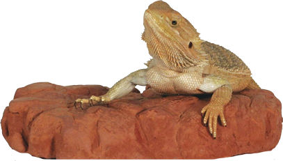
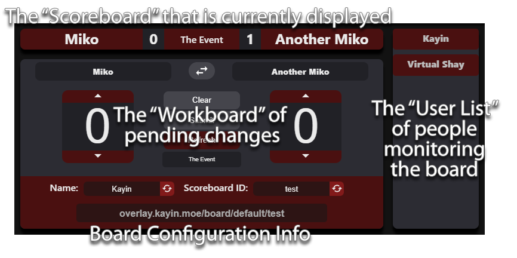
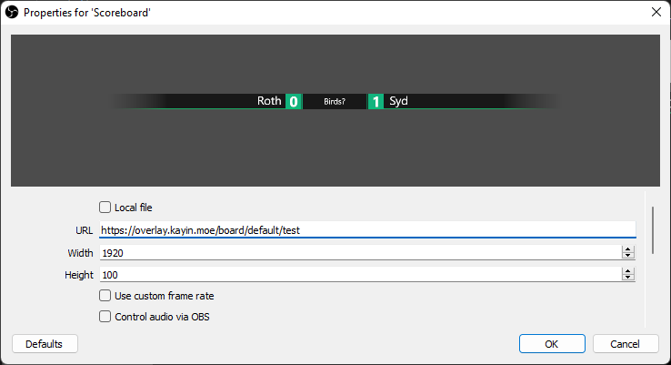

# Warm Rock Overlay

Warm Rock Stream Overlay
The Warm Rock Stream Overlay is a tool modeled of off the bigtournament.golf scoreboard that aims to be quick, easy, and remotely managable by multiple people with no signup required.

* The **Score Board** represents the info currently displayed on stream
* The **Work Board** Represents pending changes.
  - Work boards do not automatically update when new data is sent, so if two people increase a score of "0" by "1", you have the second player accidentally sending a "2".
  - The Workboard will sync with the Score Board after 10 seconds of inactivity, so a user doesn't accidentally undo changes or corrections.
  - Name Entry fields can autocomplete from a supplied player list, which can be entered manually or imported from **challonge** or **start.gg**
* The **User Board** shows the currect connected users who can edit the scoreboard
  - Anyone with the scoreboard URL can modify it. This makes it easy to share.
  - There are no moderation options (That would be hard), so be careful who you share with! You are free to generate new scoreboard IDs if you can't get a user off the scoreboard
  - Names will flash when a change is made and a tab will show you if multiple people with the same name are connected. Useful if you don't realize you have 5 tabs to the scoreboard open.
* The **Configuration** allows you to set or generate a random name or board ID, as well as links you to the default scoreboard.
  - If you change your board ID you need to change it in the OBS URL as well.
  - Your current name and ID will be remembered with cookies.

## Adding a Scoreboard to OBS

Simply add a browser source and enter the info provided to you by your scoreboard, give it a width of 1920 and it should be easy to center.

## What if I want to use my own Scoreboard graphics?

[This is a Template](https://overlay.kayin.moe/BoardTemplate.zip) with all the required websocket javascript. You can store this locally, edit the css, change the graphics or do whatever you want (I've made myself custom boards with animations).. Just make sure to put in your **board ID** in the **index.html** file so it knows what score info to ask for.

If you're running something and need a little help figuring this out, feel free to reach out to me at @kayinnasaki. I'm only giving the scoreboard out to small numbers of organizers so I should have time to help you out.

# Technical Stuff

This is a react app, with the websocket server running through node. This is the most complicated web app I've ever made and I'm not really *trained* so any help is appreciated. If you have any problems trying to spin this up, lemme know! I'd love to help people help me!
